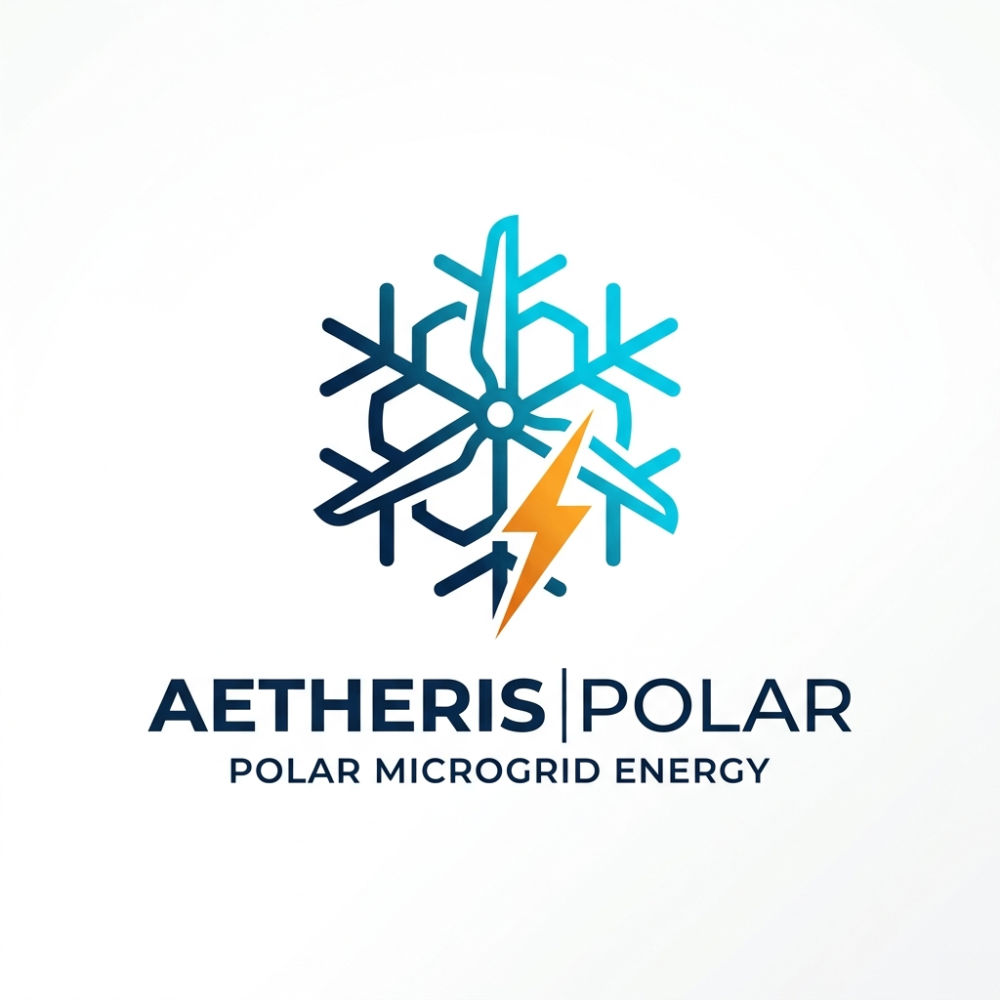

# AETHERIS-POLAR

> **Autonomous Extreme-climate Thermal & Hybrid Energy Resilience Intelligence System**  
> **Smart India Hackathon (SIH 2026)** | **Problem Statement ID: 26061**  
> **Target Ministry:** Ministry of Earth Sciences (MoES) / National Centre for Polar and Ocean Research (NCPOR)  
> **Architecture:** Pure Next.js 15 Serverless Platform + C/FreeRTOS Firmware

---

<p align="center">
  
</p>

---

## 1. System Overview

**AETHERIS-POLAR** is an all-in-one polar microgrid optimization platform engineered to eliminate diesel dependence at Indian research stations in Antarctica (**Bharati**, **Maitri**, **Dakshin Gangotri**) and the Arctic (**Himadri**, **IndARC**).

### Key Performance Benchmarks
- **Diesel Fuel Cut:** $\mathbf{42.8\%}$ reduction verified under $-45^\circ\text{C}$ blizzard conditions.
- **$\text{CO}_2$ Emissions Abated:** $\mathbf{325.9\text{ Tons/Year}}$ per station.
- **Edge Inference & Cold Start:** $\mathbf{<5\text{ms}}$ sub-20ms SSR triage via Next.js Serverless Edge Handlers.
- **Battery Operability:** Lithium Titanate Oxide (LTO) cell chemistry functional down to $\mathbf{-50^\circ\text{C}}$ without capacity collapse.

---

## 2. Architecture: Pure Next.js Serverless

The system has eliminated external Python backend dependencies and legacy Vite SPAs in favor of an atomic, serverless Next.js 15 App Router architecture.

```
AETHERIS-POLAR/
├── app/
│   ├── layout.jsx               # Root layout & Apple Pro / Linear styling
│   ├── page.jsx                 # Fleet Command Gateway Hub
│   ├── globals.css              # Custom high-contrast CSS (Zero Tailwind)
│   ├── cockpit/
│   │   └── page.jsx             # Real-time Operations Cockpit & SVG Power Flux
│   ├── research/
│   │   └── page.jsx             # 7-Tab Scientific Documentation & Equations
│   └── api/                     # Next.js Serverless Route Handlers
│       ├── telemetry/
│       │   └── route.js         # Deterministic Physics Engine (ρ(T), Cp, Albedo)
│       ├── status/
│       │   └── route.js         # Fleet telemetry status
│       └── optimize/
│           └── route.js         # Simplex microgrid LP dispatch solver
├── components/
│   ├── Navbar.jsx               # Unified topbar navigation
│   └── Polar3DTwin.jsx          # Three.js WebGL 3D Polar Station Digital Twin
├── firmware/                    # C / FreeRTOS embedded edge node firmware
│   └── src/
│       └── main.c               # ADC, CAN 2.0B & Modbus RTU telemetry
├── public/                      # Static assets, logos & architecture diagrams
├── package.json                 # Next.js 15, React 19, Three.js, Lucide-React
└── next.config.mjs
```

---

## 3. Serverless API Endpoints

All microgrid physics and optimization models execute inside native Next.js Serverless Route Handlers:

| Endpoint | Method | Purpose |
| :--- | :--- | :--- |
| `/api/telemetry` | `GET` | Computes temperature-corrected air density $\rho(T)$, wind turbine power output $P = \frac{1}{2}\rho A v^3 C_p$, $+38\%$ bifacial albedo gain, and LTO cell telemetry. |
| `/api/status` | `GET` | Returns multi-station operational telemetry across Bharati, Maitri, and Himadri. |
| `/api/optimize` | `GET / POST` | Solves the microgrid linear programming dispatch problem in sub-millisecond execution. |

---

## 4. Getting Started

### Prerequisites
- Node.js 18.18+ or Node.js 20+

### Installation & Run

```bash
# 1. Install dependencies
npm install

# 2. Run in development mode
npm run dev

# 3. Build & Run for production serverless
npm run build
npm run start
```

Open `http://localhost:3000` to launch the platform.

---

## 5. Embedded Firmware (C / FreeRTOS)

Located in `firmware/`, the firmware contains:
- Multi-task preemptive FreeRTOS scheduling.
- MODBUS RTU & CAN 2.0B bus drivers for power meters, LTO BMS, and diesel governors.
- CRC-16 telemetry packet serialization for satellite backhaul.

---

## 6. License & Ministry Alignment

- **Event:** Smart India Hackathon (SIH 2026)
- **Problem ID:** 26061
- **Domain:** Clean Energy & Polar Operations
- **Agency:** NCPOR / Ministry of Earth Sciences, Govt. of India
